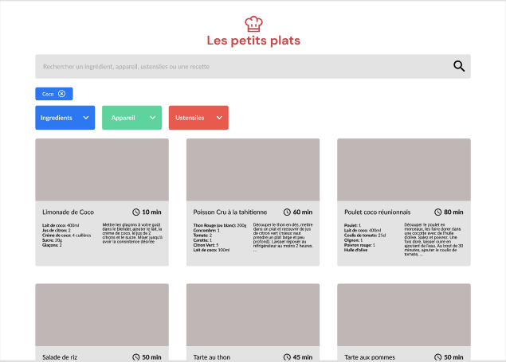
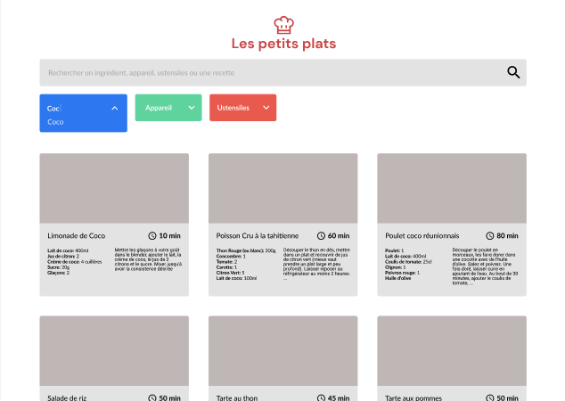
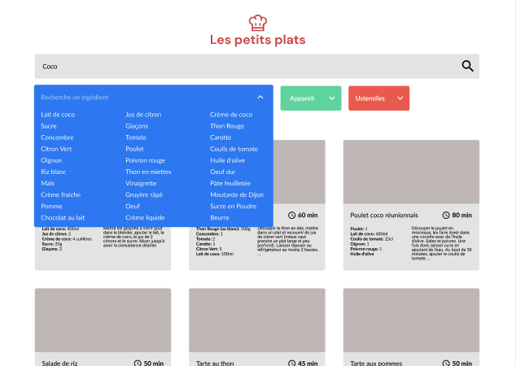

  

# Les petits plats

## Description

Projet 7 du parcours développeur Front-end DA - Javascript chez Openclassrooms qui a pour objectif de créer une page web fonctionnelle de recettes de cuisine à partir d'une maquette fournie et de développer un algorithme de recherche de recettes en javascript.
Il faudra proposer 2 versions différentes de l'algorithme et choisir la plus performante.

## Lien du projet

[Site Web Les petits plats](https://devnicolay.github.io/LauraNicolay_7_04112021/)

## Maquette de la page d'accueil

## Éléments fournis par l’entreprise virtuelle

- La maquette avec différent stade des recherches par champs principal ou par listes déroulantes [Maquettes](https://www.figma.com/file/xqeE1ZKlHUWi2Efo8r73NK/UI-Design-Les-Petits-Plats-FR?node-id=0%3A1)
- Le fichier javascript contenant un tableau JSON de 50 recettes [Tableau JSON](https://github.com/OpenClassrooms-Student-Center/P11-front-end-search-engine)
- La description des cas d'utilisation de recherche [Cas d'utilisation](https://s3-eu-west-1.amazonaws.com/course.oc-static.com/projects/Front-End+V2/P6+Algorithms/Cas+d%E2%80%99utilisation+%2303+Filtrer+les+recettes+dans+l%E2%80%99interface+utilisateur.pdf)

## Cahier des charges

- Il faudra implémenter 2 versions différentes de l'algorithme de du champ de recherche principal sur 2 branches Git différentes
- Il faudra faire une fiche d'investigation de fonctionnalité avec algorigramme
- Pour choisir le meilleur algorithme, il faudra les tester avec un outil de comparaison de performance. [Jsben.ch](https://jsben.ch/)
- Le développement devra se faire en HTML, CSS, et JavaScript Pur (Pas de jQuery)
- Possibilité d'utiliser Bootstrap
- Vérification du site au validateur W3C

### Recherche de recettes de cuisine

- Dans le champs de recherche principal : recherche par nom ou par description ou par ingrédients
- Dans la liste déroulante ingrédients avec possibilité de trier les ingrédients avec le champ de recherche dans la liste déroulante.
- Dans la liste déroulante appareils avec possibilité de trier les appareils avec le champ de recherche dans la liste déroulante.
- Dans la liste déroulante ustensiles avec possibilité de trier les ustensiles avec le champ de recherche dans la liste déroulante.
- Ajout de Tag lorsqu'un ingrédient, un appareil ou un ustensil est selectionné

### Comparaison de performance

[Comparaison des 2 versions de l'algorithme](https://jsben.ch/mKFQ1)

## Outils utilisés

- Visual Studio Code avec les plugins Live server et Live compilation Sass
- Git
- GitHub pour le versionning
- Heberger le site sur GitHub Pages
- EsLint
